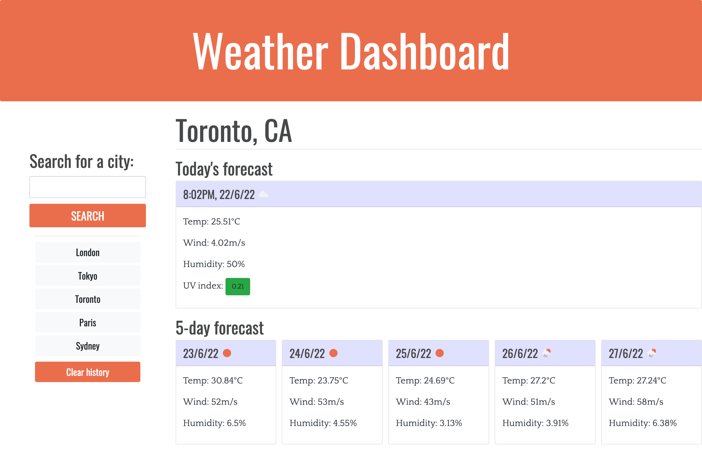

# weather-dashboard

## Description

My goal for this project was to build a dashboard that shows the current and predicted weather forecasts for selected cities. There is a search function that allows the user to select a city, which is then added to the search history. The user is then able to look through their search history and click between the weather for multiple cities. This may be particularly useful when travelling.

To achieve this, I used HTML, CSS and Javascript.

During this project, I consolidated my understanding of HTML, CSS and Javascript. In particular, I re-inforced what I have learnt about third-party APIs and utilised:
- Bootstrap
- Moment.js()
- And, OpenWeather.

## Access

To access the live application via Github Pages, click [here](https://hayleyarodgers.github.io/weather-dashboard/). 

To access the repository where the code I refactored is saved, click [here](https://github.com/hayleyarodgers/weather-dashboard).

## Credits

- I used the [OpenWeather One Call API 1.0](https://openweathermap.org/api/one-call-api) for weather data.
- I used the [OpenWeather Geocoding API](https://openweathermap.org/api/geocoding-api) to give latitude and longitude data for selected cities so that I could then use the OpenWeather One Call API.
- I used [this tutorial](https://coding-boot-camp.github.io/full-stack/apis/how-to-use-api-keys) to set up an API key and start using the OpenWeather APIs.